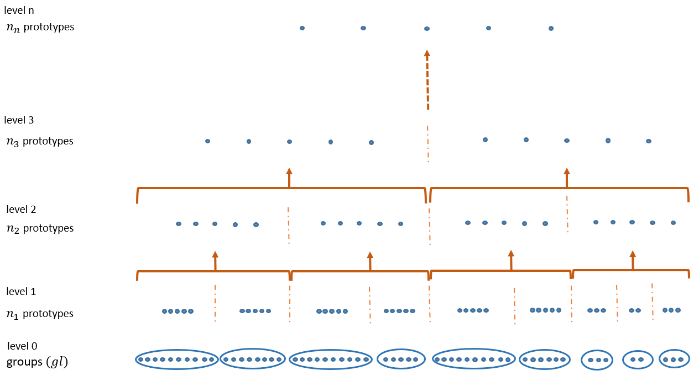
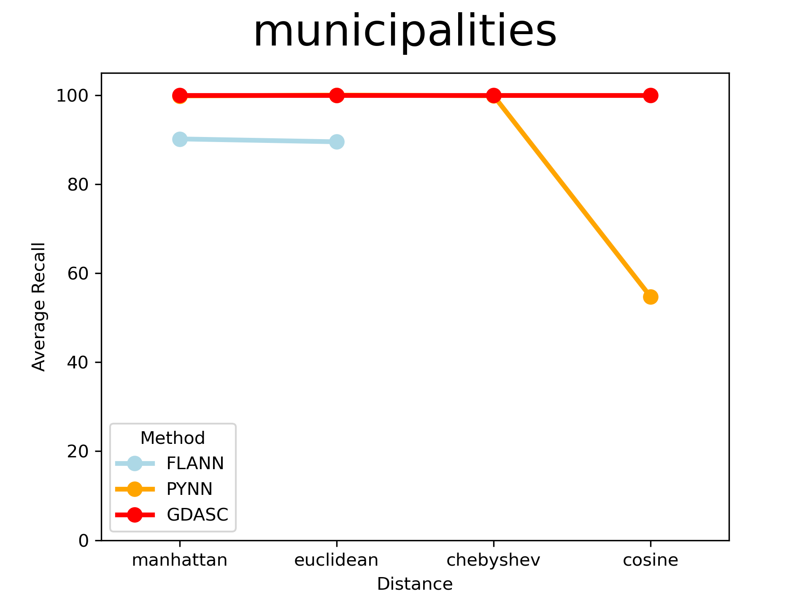
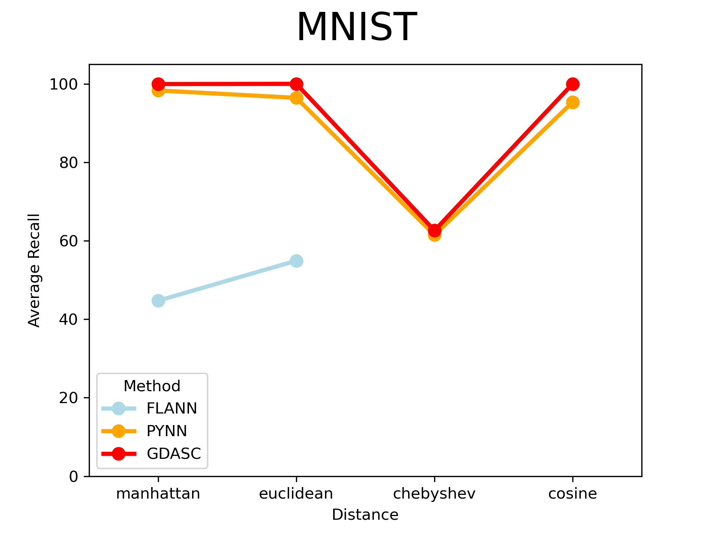
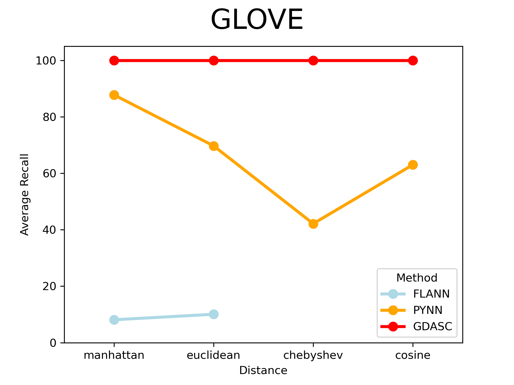
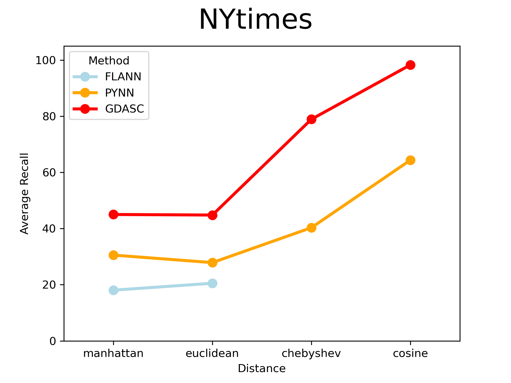
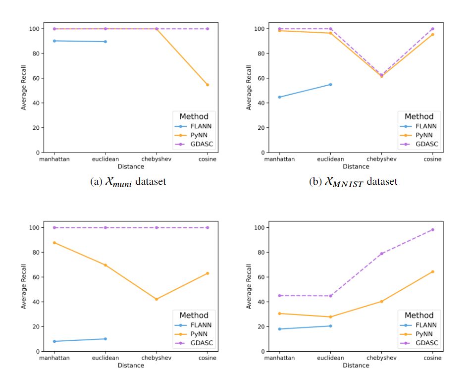

# GDASC - General Distributed Approximate Similarity search with Clustering

This project proposes GDASC (General Distributed Approximate Similarity search with Clustering) a novel generalized algorithm for distributed approximate similarity search that accepts any arbitrary distance function. It employs clustering algorithms that induce Voronoi regions in a dataset and yield a representative element, such as k-medoids, to build a multilevel indexing structure suitable for large datasets with high dimensionality and sparsity, usually stored in distributed systems.
<!-- * This project proposes a new algorithm GDASC (General Distributed Approximate Similarity search with Clustering), a novel algorithm designed for efficient approximate similarity search.-->

<!-- 
This project proposes a new algorithm GDASC that is a generalized algorithm to solve the approximate nearest neighbours (ANN) search problem for distributed data that accepts any arbitrary distance function by employing data partitioning algorithms that induce Voronoi regions in a dataset and yield a representative element, such as k-medoids.-->

<!-- ## Installation: -->
## Summary of features
<!-- * GDASC constructs a multilevel indexing structure, making it suitable for large, high-dimensional, and sparse datasets typically stored in distributed systems. <!-- This algorithm is adaptable with various clustering algorithms, including k-means, k-medoids, and DBSCAN..., and has already been successfully applied to k-medoids.
* GDASC, is an adaptable algorithm  with various clustering algorithms, such as k-means and k-medoids. Notably, it has already been successfully applied with the k-medoids algorithm, demonstrating its versatility and effectiveness in diverse clustering scenarios.

* GDASC uses k-medoids to enhance compatibility with any distance function, Unlike many similarity search algorithms that rely on k-means (usually associated with the Euclidean distance).
-->

__Multilevel Indexing Structure and k-Nearest Neighbors Search__

GDASC framework implements an advanced multilevel indexing structure suitable for large, 
high-dimensional datasets, typically stored in distributed systems.

It relies on two algorithms to search for the k approximate nearest neighbors:
* The **Multilevel Structure Algorithm (MSA)** constructs the multilevel index by employing clustering algorithms that generate representative points summarizing the dataset, allowing GDASC to adapt to the specific characteristics of the data.
* The **Neighbors Search Algorithm (NSA)** complements this by efficiently searching for neighbors within the indexed structure, utilizing the multilevel representation to quickly identify relevant data points. 

__Versatile and Adaptable__

GDASC distinguishes itself as a versatile and adaptable framework for data indexing, capable of integrating various clustering algorithms and distance functions.

The proposed approach for constructing the multilevel structure used in the search process is designed to accommodate 
any clustering algorithm that generates representatives summarizing the underlying dataset and supports the use of 
arbitrary distances, thereby making the framework adaptable to the specific characteristics of the dataset. 

This approach significantly broadens the spectrum of compatible problems while offering desirable scalability 
through the bottom-up construction of the search tree, providing a competitive edge over other state-of-the-art 
algorithms that require centralisation of all data on a single server.

### Clustering Algorithms:

| Algorithm   | Parameters                                         | Implementation                                    |
|-------------|----------------------------------------------------|---------------------------------------------------|
| **k-means** | - `n_clusters`: Number of clusters (default: 8)    | - `scikit-learn`: `sklearn.cluster.KMeans`        |
|             | - `init`: Method for initialization (default: 'k-means++') | - `The Algorithms`: `Python.machine_learning.k_means_clust`|
|             | - `n_init`: Number of time the algorithm will run with different centroid seeds (default: 10) |                                                   |
|             | - `max_iter`: Maximum number of iterations (default: 300) |                                                   |
|             | - `tol`: Relative tolerance with regards to inertia to declare convergence (default: 1e-4) |                                                   |
| **k-medoids** | - `n_clusters`: Number of clusters (default: 8)    | - `scikit-learn-extra`: `sklearn_extra.cluster.KMedoids` |
|             | - `init`: Method for initialization (default: 'heuristic') | - `PyClustering`: `pyclustering.cluster.kmedoids` |
|             | - `max_iter`: Maximum number of iterations (default: 300) |                                                   |
|             | - `metric`: The distance metric to use (default: 'euclidean') |                                                   |

### Supported distances:

| Distance      | API         | Equation                                                                                                                                                                                                                                                                                                                   |
|---------------|-------------|----------------------------------------------------------------------------------------------------------------------------------------------------------------------------------------------------------------------------------------------------------------------------------------------------------------------------|
| **Euclidean** | `euclidean` |                                                                                                                                                  |
| **Manhattan** | `manhattan` |                                                                                                                                                                          |
| **Chebyshev** | `chebyshev` |                                                                                                                                                                                              |
| **Minkowski** | `minkowski` |                                                                              |
| **Cosine**    | `cosine`    |  |
  
    

## Benchmarks:

To comprehensively evaluate its performance, an extensive series of experiments is conducted across datasets varying in type, size, dimensionality, and sparsity.

By using the train set, we approach MSA using Euclidean, Manhattan, Chebyshev, and cosine distances, respectively. Then, we perform searches for the 5, 10, and 15 approximate nearest neighbors of every query point contained in the corresponding test set. 

The average recall of the searches conducted is computed and compared with those obtained by employing two other algorithms: PyNN and FLANN.

### Datasets:
| Dataset                                                       | Label       | N         | Dimensionality | High Sparsity | Data Type  | 
|---------------------------------------------------------------|-------------|-----------|----------------|---------------|------------|
| [**Municipalities**](https://doi.org/10.5281/zenodo.12759082) | X_muni      | 8,130     | 2              | No            | Geospatial |
| [**MNIST**](https://doi.org/10.5281/zenodo.12759284)          | X_MNIST     | 69,000    | 784            | Yes           | Image      |
| [**GLOVE**](https://doi.org/10.5281/zenodo.12759356)          | X_GLOVE     | 1,000,000 | 100            | No            | Text       |
| [**NYtimes**](https://doi.org/10.5281/zenodo.12760693)        | X_NYtimes   | 290,000   | 256            | No            | Text       |

### Approximate Algorithms:
  
* __PyNNDescent__  constructs a graph-based index by connecting each data point to its approximate nearest neighbours. It iteratively improves the graph structure through neighbour descent steps, employing techniques such as random initialisation, multi-tree searching, and pruning. The algorithm also provides parameters to control the trade-off between search accuracy and computational cost.
* __FLANN__ employs techniques such as random projection and hierarchical subdivision to construct an index structure that enables faster search operations.
 
### Results
For each dataset, a pointplot illustrates the recall of three different algorithms across various distance metrics (Manhattan, Euclidean, Chebyshev, Cosine) in approximate nearest neighbor search.
<!-- 
### Dataset 1:

### Dataset 2:

### Dataset 3:

### Dataset 4:

 -->

Our findings not only demonstrate the efficiency of this novel framework 
but also support the hypothesis that the use of alternative distances beyond 
the Euclidean metric may yield superior results for nearest-neighbour queries, 
depending on the specific characteristics of the dataset.
  

